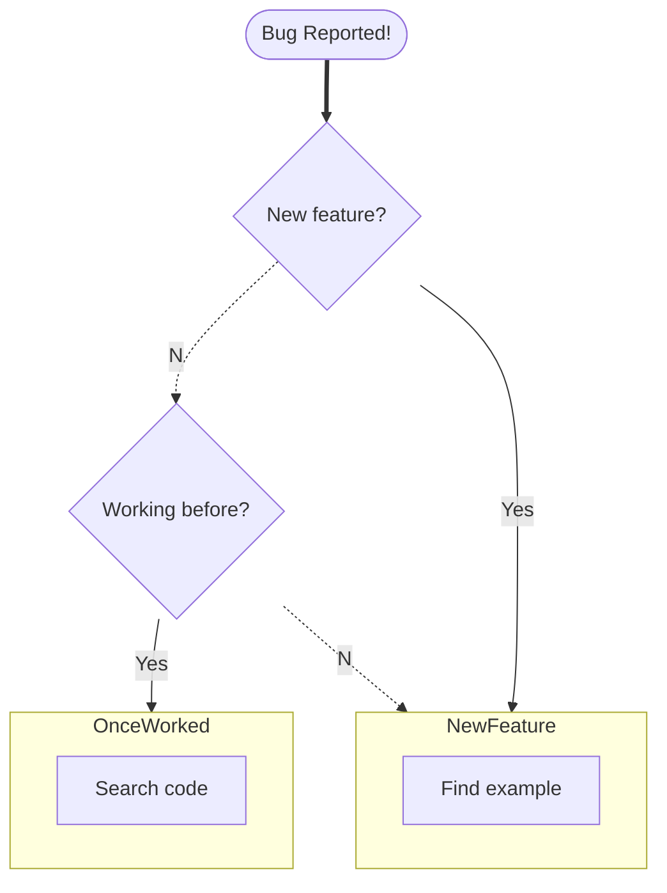
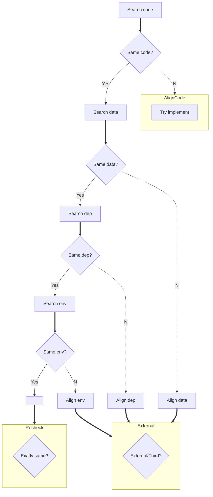
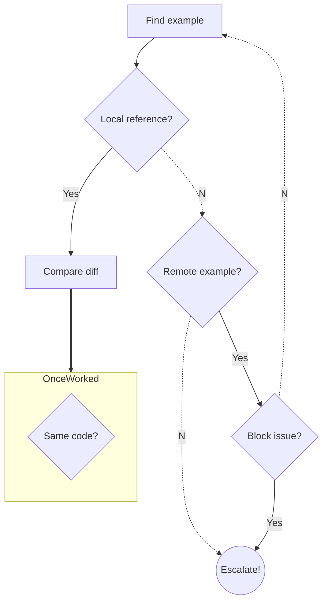

# The Debugging Flowchart!

## Version: 1.0.0

- [Changelog](./CHANGELOG.md)
- [License](./LICENSE)

Use this flowchart to navigate across debugging sessions.

## Contributing

This flowchart was created in [Excalidraw](https://excalidraw.com/). As the Excalidraw file emits JSON output, it can be easily versionable. Please submit your PRs updating the `.excalidraw` file and replacing the PNG (which you can export from Excalidraw itself).

You can also contribute by transalting the chart to other languages, creating new designs, you name it.

Don't forget to update the version, in the `.excalidraw` file, as well as the changelog and this file itself, as follows:

- **Patch**: Design tweaks, readability, color themes
- **Minor**: New flows or conventions
- **Major**: Flow updates, new flow remappings

---

Start here
---

OnceWorked
---

NewFeature
---

